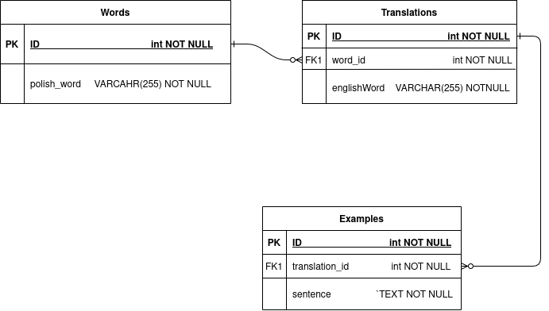

# Translator API Documentation

## Table of Contents
- [Project Overview](#project-overview)
- [Database Structure](#database-structure)
- [Resolvers (GraphQL)](#resolvers-graphql)
  - [Mutations](#mutations)
  - [Queries](#queries)
- [Converters](#converters)
- [GQLGen Model](#gqlgen-model)
- [Server Configuration](#server-configuration)
- [Testing](#testing)

---

## Project Overview
This project is an API for managing words and their translations between Polish and English. The API allows adding, deleting, and retrieving words, their translations, and example sentences.

---

## Database Structure
The database is based on PostgreSQL and is managed using GORM. 
The `Word` table stores words in Polish. 
The `Translation` table stores their English equivalents. 
The `Example` table stores example sentences linked to a given translation.

The file `database/database.go` contains the `InitDB()` function, which initializes the database connection.

ERD diagram:

---

## Resolvers (GraphQL)
Resolvers are responsible for handling GraphQL queries and mutations. They are located in `graph/resolver.go`.

### Mutations
Mutations are used to add and delete data:
- `CreateWord(polishWord, englishWord?, sentence?)` - Adds a new word to the database, along with an optional translation and example sentence.
- `CreateTranslation(polishWord, englishWord, sentence?)` - Adds a new translation for an existing word.
- `CreateExample(polishWord, englishWord, sentence)` - Adds an example sentence for a given translation.
- `DeleteWord(polishWord)` - Deletes a word along with its translations and examples.
- `DeleteTranslation(polishWord, englishWord)` - Deletes a specific translation of a word.
- `DeleteExample(polishWord, englishWord, sentence)` - Deletes an example sentence for a given translation.
- `ReplaceTranslation(polish_word, englishWord, newTranslation)` - Deletes old translation from database and creates new translation, if no 

All operations are performed within GORM transactions to ensure data integrity.

### Queries
Queries allow retrieving data:
- `Words()` - Retrieves all words along with their translations and examples.
- `Translations(polishWord)` - Retrieves translations for a given word.
- `Examples(polishWord, englishWord)` - Retrieves examples for a given translation.

---

## Converters
The file `graph/converter.go` contains functions that convert database objects to GraphQL format:
- `ToGraphQLWord(*models.Word) *model.Word`
- `ToGraphQLTranslation(*models.Translation) *model.Translation`
- `ToGraphQLExample(*models.Example) *model.Example`

---

## GQLGen Model
The file `graph/model.go` contains definitions of data structures used in GraphQL:
- `Word`
- `Translation`
- `Example`

---

## Server Configuration
The GraphQL server is generated using GQLGen. The `Resolver` structure handles mutations and queries via `MutationResolver` and `QueryResolver`. The server interacts with the database via GORM, with connection settings defined in `database/database.go`.

---

## Testing
Unit tests are implemented in the `graph_test` package using `testing` and `github.com/stretchr/testify/assert`.

### Test Cases
- `TestCreate` - Tests the creation of words, translations, and examples in a mock database.
- `TestCreateFull` - Verifies full word insertion with translation and example.
- `TestDelete` - Ensures words, translations, and examples are deleted correctly.
- **`TestConcurrentCreateWordMutations`**  
  Tests concurrent creation of multiple words using mutations to simulate a high-load environment. Verifies that 10 words are successfully created in the database.  
  - **Details**: Concurrently creates multiple words ("apple", "banana", etc.) and checks if they are inserted correctly.

- **`TestConcurrentLocking`**  
  Tests how the system handles concurrent requests to create the same word multiple times. Ensures that only one word is saved in the database.  
  - **Details**: Concurrently tries to insert the same word ("a") multiple times and verifies that only one instance is stored in the database.

- **`TestConcurrentTrnaslations`**  
  Verifies concurrent creation of translations for a word. Tests how the system handles multiple translation insertions at once.  
  - **Details**: Creates a word ("a") and then inserts translations for it concurrently, verifying that 10 translations are added to the database.

---

Each test case initializes an in-memory database using `mockdatabase.MockDB(t)`, that is a conecting user to test postgresql that needs to be initialized before testing:

sudo docker run --name postgres-test -e POSTGRES_USER=test_user -e POSTGRES_PASSWORD=test_pass -e POSTGRES_DB=translatorapi_test -p 5433:5432 -d postgres

---

## Summary
This project enables managing words, translations, and example sentences using GraphQL and GORM. 
- Data is stored in PostgreSQL.
- The API uses GraphQL for querying and modifying data.
- All operations are performed within GORM transactions.
- Conversions to GraphQL format take place in dedicated functions in `graph/converter.go`.
- Unit tests validate core functionality, ensuring database integrity and concurrency safety.

